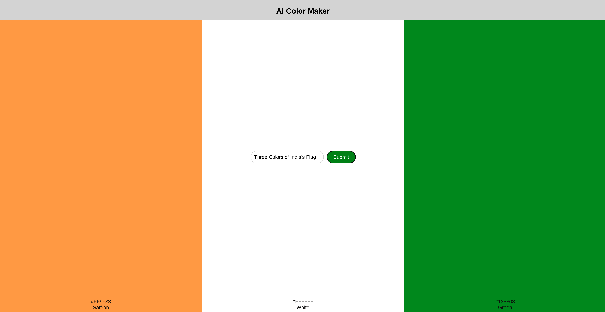

# AI Color Maker

AI Color Maker is a web application that generates color palettes based on user input using OpenAI's API. The application consists of a ReactJS frontend and a FastAPI backend.



## Project Overview

The AI Color Maker project allows users to input a brand or keyword, and in return, it generates a color palette. The backend makes a call to the OpenAI API to fetch the colors, while the frontend displays them to the user in a visually appealing manner.

### Technologies Used

- **Frontend**: ReactJS
- **Backend**: FastAPI
- **API**: OpenAI

## Setup Instructions

### Prerequisites

- Node.js and npm installed
- Python installed
- OpenAI API key

### Backend Setup

1. **Clone the Repository**

   ```bash
   git clone https://github.com/jatindera/ai-color-maker.git
   cd ai-color-maker/backend
   ```

2. **Create a Virtual Environment and Install Dependencies**

   ```bash
   python -m venv venv
   source venv/bin/activate  # On Windows use `venv\Scripts\activate`
   pip install -r requirements.txt
   ```

3. **Configure Environment Variables**

   Create a `.env` file in the backend directory and add your OpenAI API key:

   ```plaintext
   OPENAI_API_KEY=your_openai_api_key
   ```

4. **Run the FastAPI Server**

   ```bash
   fastapi dev main.py
   ```

### Frontend Setup

1. **Open Another Terminal Window and Navigate to the Frontend2 Directory**

   ```bash
   cd ai-color-maker/frontend2
   ```

2. **Install Dependencies**

   ```bash
   npm install
   ```

3. **Start the React Application**

   ```bash
   npm start
   ```

### Running the Application

1. Open your web browser and navigate to `http://localhost:3000`.
2. Enter a brand or keyword in the input field.
3. Click the "Submit" button.
4. The application will generate and display a color palette based on the input.

## Usage

1. **Enter Input**: Type in the brand or keyword for which you want to generate a color palette.
2. **Generate Palette**: Click on the "Submit" button to generate the color palette.
3. **View Results**: The generated color palette will be displayed on the screen.


## Acknowledgements

- OpenAI for providing the API
- FastAPI for the backend framework
- ReactJS for the frontend framework
